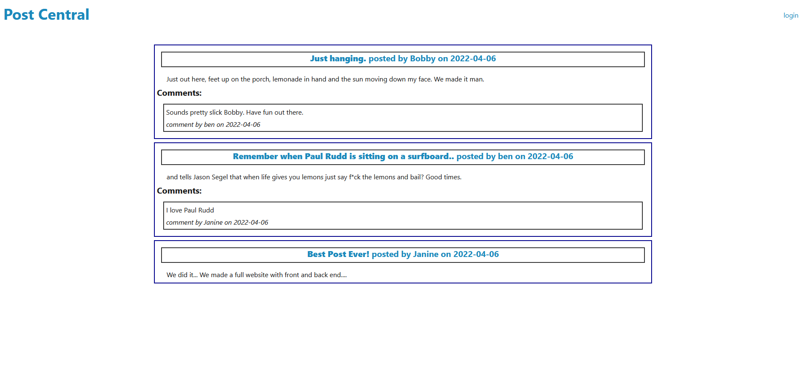

# MVC Tech Blog &middot;    
   
  This app serves as a community dashboard of sorts. People are able to Create posts (and edit them on their profile page), comment on posts, as well as delete their own post and comments.   

  ## Table of Contents  
  &middot; [Installation](#installation)  
  &middot; [Contributing](#contributing)   
  &middot; [Questions](#questions)  
  &middot; [License](#license)  
  
  # Installation  
  
  1. Clone the repo.  
  2. Run npm i in command line.   
  3. Make the .env.EXAMPLE file into a .env file and enter your information.  
  4. npm run seed if you wish to populate the database with some data. 
  5. npm start and listen to that kitty purrrrr. 
   
  # Contributing  
    
  Have at it!  
   
  # Questions  
    
  GitHub: https://github.com/b-e-christensen  
  Email: dev.ben.christensen@gmail.com
   
  # License  
    
  This project is <a href="https://opensource.org/licenses/MIT" target="_blank">MIT</a> licensed.